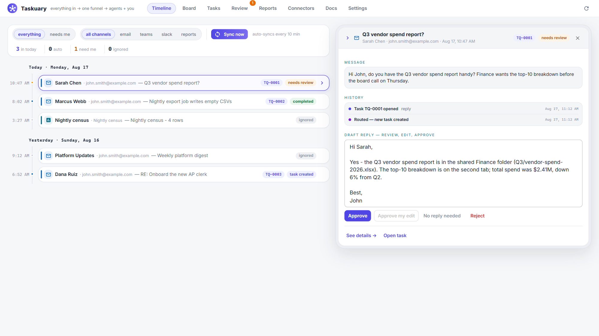

# Taskuary

**The operating system for automating your work.**

Everything that lands on you — email, chat, scheduled reports, GitHub — flows into one
funnel. AI triages it, your coding agents work it, and nothing ships without your
approval. Fully local: your data, your keys, and your agents stay on your machine.



- **Everything in, one timeline.** Mail, Teams, Slack, and scheduled reports land on one
  day-rail feed. AI triage decides what is a real task, what just needs a reply, and
  what is noise. No AI connected yet? Nothing is lost — items file quietly until you add one.
- **Agents do the work.** Point Taskuary at the coding CLI you already use — Claude
  Code, Codex, Gemini, Cursor, Copilot — and tasks flow to it: it works in your repos,
  reports back with the diff, and you can message it mid-task (it resumes its session).
- **You stay in charge.** AI-drafted replies wait for your approve / edit / reject. A
  kanban board shows every agent's live status. Deterministic policy rules the AI can
  never override, and a tamper-evident audit log of everything.

## Get started

```bash
pip install git+https://github.com/ldbumble/taskuary
taskuary        # opens http://127.0.0.1:7787
```

Python 3.10+ is the only requirement. Then open **Connectors** and click through the
wizards — each one takes a minute or two:

1. **AI** — paste an Anthropic / OpenAI / Azure OpenAI key. This turns on triage.
2. **A channel** — Outlook, Teams, or Slack, so inbound lands on your Timeline.
3. **A coding agent** — pick a preset (Claude Code, Codex, Gemini, Cursor, Copilot),
   Save, Test. Add GitHub (paste a PAT — repos auto-discovered) for the full
   issue → work → report → close loop.
4. Then build **Reports**: connect SQL Server once (or use MCP / SQLite / REST / RSS)
   and schedule queries with an AI prompt that summarizes the results onto your Timeline.

Prefer a desktop app? `pip install "taskuary[desktop] @ git+https://github.com/ldbumble/taskuary"`
then `taskuary-desktop` — the same UI in a native window. A prebuilt single-file
`Taskuary.exe` is attached to every CI run.

## The workspace

- **Timeline** — every inbound item on a day-grouped rail: who/where, what Taskuary did
  with it, current state. Filter by state (everything / needs me) and channel
  independently. Click a row for the full review canvas — message, agent report, code
  diff, history — and decide inline.
- **Board** — the agent kanban: Queued / Agent working / Waiting on you / Done, each card
  showing the live agent-run status. Drag between columns; click a card for the full
  story; "New task for the agent" sends work straight to your coder.
- **Tasks** — the dense two-pane view: messages with routing decisions, agent runs with
  prompts, traces and diffs, dispatch any agent, message the working agent, "Not a task"
  (which teaches the funnel).
- **Review** — the decision queue: approve / approve-my-edit / no-reply / reject, plus
  Draft-with-AI. Nothing sends without you.
- **Reports** — the pipeline builder: source → query → optional AI summary → Timeline,
  on a schedule, with a full-pipeline Preview before you save.
- **Connectors** — a searchable catalog of connections with a setup wizard per card: AI
  models and CLI agents, messaging channels, GitHub, SQL Server.
- **Docs** — the operator documents (SOUL.md / CODER.md / DIGEST.md): plain-markdown
  rules injected into every agent run. They ship as templates and maintain themselves —
  connectors and discovered repos write themselves in.
- **Settings** — triage knobs with plain-English help, deterministic routing policies,
  the agent's learned memory, and one-click audit-chain verification.

## Bring your own agent

Any CLI that reads a prompt on stdin works. The presets ship the right headless flags —
the important one being the auto-approve flag (`--dangerously-skip-permissions`,
`--full-auto`, `--yolo`, …): without it a headless agent hangs waiting for an approval
click that never comes. The built-in **Test** runs one tiny prompt through your CLI to
prove the wiring before it goes live. Claude Code's JSON output is parsed natively,
which enables resumable message-the-agent sessions; plain-text CLIs work too.

## Integrations

| type | status | notes |
|------|--------|-------|
| `outlook` / `teams` / `slack` | ✅ | inbound channels → Timeline through AI triage |
| `github` | ✅ | PAT → auto repo discovery, issue loop, repo map in SOUL.md |
| `anthropic` / `openai` / `azure_openai` | ✅ | AI for triage + report summaries |
| `mssql` | ✅ | connect once; build AI-summarized reports on the Reports tab |
| `mcp` | ✅ | any MCP server's tool as a scheduled report |
| `sqlite` / `rest` / `rss` | ✅ | scheduled reports, AI summaries optional |
| `postgres` `mysql` `snowflake` `sharepoint_list` `google_sheets` `s3_object` `graphql` `smb_file` `prometheus` `jira` | 🗺 planned | one ~15-line executor away — PRs welcome |

Anything can also **push** items in: `POST /api/ingest/push` with
`{subject, body, from_email, channel}` — cron jobs, webhooks, other apps. The full API is
browsable at `/api/docs` while the server runs.

## Development

```bash
git clone https://github.com/ldbumble/taskuary && cd taskuary
pip install -e .[dev,mssql,desktop]
taskuary --debug            # verbose console; every run also logs to ~/.taskuary/taskuary.log

pytest -q                   # 58 tests, ~1s, no network needed

cd website                  # the React UI (React 18 + MUI, Vite)
npm install
npm run dev                 # dev server, proxies /api to a running taskuary on :7787
npm run build               # emits taskuary/web/ (committed - pip installs need no node)

pip install -e .[build]
pyinstaller taskuary.spec   # dist/Taskuary.exe - single-file desktop build
```

Data lives in `~/.taskuary/` (override with `TASKUARY_HOME`): `taskuary.db` (SQLite),
`config.toml`, `taskuary.log`. For LAN use set `[server].token` in config and send it as
the `X-Taskuary-Token` header. CI runs the test matrix on Windows / Linux / macOS ×
py3.10 / 3.12 plus the web and exe builds on every push.

## Status / roadmap

Early (v0.1.0) and moving fast.

- [x] AI-gated triage, review queue, resumable agent sessions, hash-chained audit
- [x] Reports tab: source → query → AI summary → Timeline pipelines
- [x] Connectors catalog with setup wizards: channels, AI, GitHub, SQL Server
- [x] Agent presets (Claude Code, Codex, Gemini, Cursor, Copilot) with one-click Test
- [x] Desktop app + single-file Windows exe
- [ ] Git worktree isolation per task attempt
- [ ] More ingest channels and report connectors (table above)
- [ ] Tray + notifications for the desktop shell

## Credits

Patterns borrowed with gratitude from **Buzz** (hash-chained audit), **Macro** (unified
memory), and **vibe-kanban** (local-server app model, agents in worktrees). MIT licensed.
