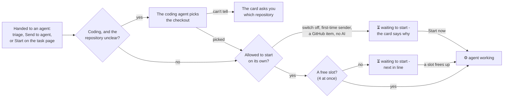
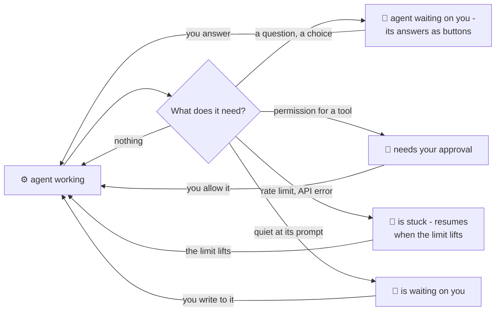
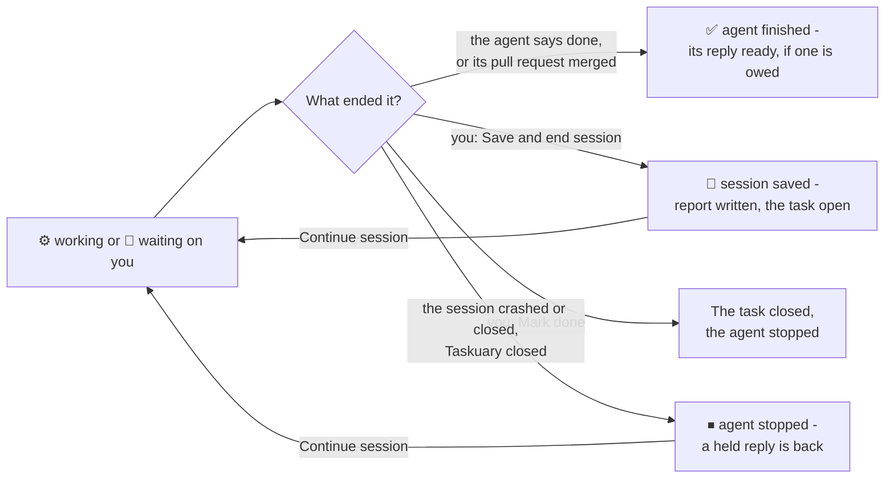

# The agent lifecycle

How an agent gets a task, what it can be doing, how it ends and what brings it back - as decided with the owner on
2026-09-25 (A1-A23) and built the same day. Six states, one word and one mark each, on every surface
(`taskuary/lanes.json`). The code: `ingest.py` (auto-start), `terminal.py` (sessions, `close`, `release_task`,
`release_held`), `coder.py` (`wrap`, `finish`), `workerstate.py` and `general.py` (what a session needs),
`funnel.py` (`not_started_why`, `left_by_facts`), `processing_unread.py` (the rail's lane), `server.py`
(`continue_work`).

## Starting

## While it runs

## How it ends, and what brings it back

## The rules

| # | Rule | Decided |
|---|---|---|
| A1/A2 | A session you end is **session saved** - never "left without finishing", and ending it never writes "open again, nobody is working it" | built |
| A3 | Waiting to start says the real reason: next in line, a start that failed (and why), auto-start off, a first-time sender | built |
| A5 | Cancelling a queued start takes the agent off; the task is yours | built |
| A6 | A reply held while the agent worked comes back when the session ends - unless the agent wrote a newer one | built |
| A7 | One word and one mark per state, one name per button, everywhere | built |
| A9 | A regular agent's questions and answer choices reach you, as a coding agent's do | built |
| A10 | A regular-agent task that did not auto-start is waiting to start, not your own work | built |
| A15 | Whether an agent is asking is read from its session, the same on every surface | built |
| A16 | The Timeline's All and the work rail read one lane rule from the same facts | built |
| A17 | Agent finished is kept by why the task closed; a finish with a reply is one card, the reply to send | built |
| A18 | An accepted Advisor idea starts its agent through the same queue and slot limit as any task | built |
| A19 | **Continue session** on a stopped, saved or paused agent - coding or regular - with what to tell it as it picks up | built |
| A20 | Save and end session only where a live session exists | built |
| A21 | A merged or closed pull request owes nobody a reply | built |
| A22 | Every start clears the interrupted mark, the saved mark and the queued start | built |
