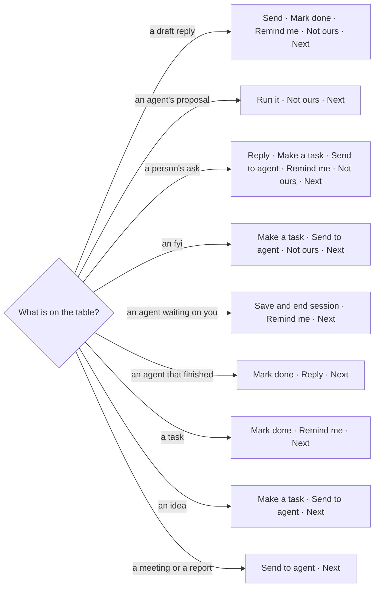
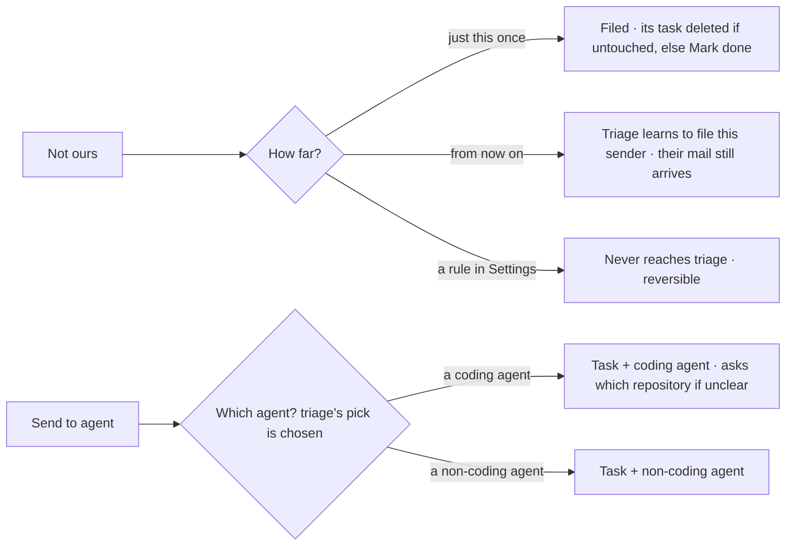
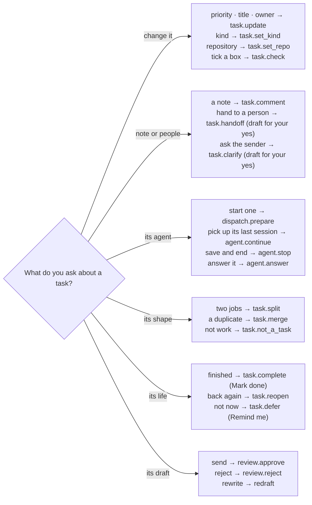

# The Assistant's words

Every button under an Assistant card, what it does, and the words that work typed instead. Decided with
the owner word by word on 2026-09-25: 19 buttons became 8, and anything that lost its button still works
when you ask for it. If you are adding a button to a card, it is one of these or it goes through the same
proposal road (`concierge.PROPOSALS`), and it gets a row here and on the docs site
(`docs/site/assistant.md`).

The code: `concierge.CHIPS` (which buttons a card offers), `CHIP_WORDS` (their labels), `ALTS` (the one
question a card asks), `PROPOSALS` (what each runs), `toolcatalog.PURPOSE` (the tools the model may call).

## Which buttons each card shows

## The two buttons that ask one question

## Rules

- **Nothing runs from a sentence alone.** A button or a typed ask becomes a card; the card's button runs it.
  The exceptions run at once because they can be undone from the receipt: Next, Mark done, Save and end
  session, Remind me, and settings, reports and connections changed by name.
- **Next is the only "not now".** Open work you pass with Next comes back after `task_return_minutes`
  (three hours). A date is the task's own **Remind me** (`remind.py`); on that morning a note on the task
  brings it back.
- **Reply on a finished agent** is for the one that left no draft. A pull request's result offers none.
- **Retired words** (`parse_decision` maps the model's old verbs): Archive it is Not ours; Later, Tomorrow,
  "file this kind", and the `setting` verb are gone - a setting is the `setting.set` tool.

## Everything the task page can do, asked for in words

Every action on a task's page is also one of the Assistant's tools (`toolcatalog.PURPOSE`), run by the page's own
handler (`server._run_operation`). A tool acts on the task on the table or the one named (TQ-0123) - never a guess.
Replayed against the owner's real Assistant on 2026-09-25: 25 of 26 asks took the right tool on the right task.

