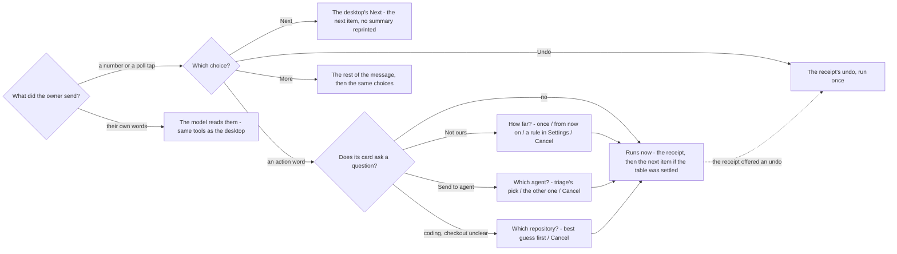

# The phone's choices

The owner, 2026-09-25: the phone Assistant matches the desktop Assistant exactly; the only differences are
formatting that reads well in WhatsApp, and buttons to tap. A chat has no buttons, so every choice is a
numbered line, and on WhatsApp the same lines also arrive as a poll under the message.

## What a pick does

A number, or a tap in the poll, is the desktop's button. It runs in code on the same road the button uses
(`concierge.propose_direct`, `run_proposal`, `surface`). The model never reads it. Only words the owner
types go to the model.

## The rules

| # | Rule | Why |
|---|---|---|
| 1 | A pick runs the desktop's action in code; the model reads only typed words | a pick used to go to the interpreter as words and could come back as a different verb |
| 2 | A card's own question is asked as numbered choices, and nothing runs until it is answered | the phone skipped "how far?" and ran Not ours as just-this-once, and guessed the agent and the checkout |
| 3 | The choice that was already the answer is the confirm; another answer runs at once | one tap, not a second "yes, go ahead" |
| 4 | A list answers one reply; after any reply its numbers are gone | a "2" typed three turns later fired a list nobody was looking at |
| 5 | A receipt that can be undone offers **Undo** as a choice | the undo existed only as the typed word |
| 6 | No typed word is a shortcut: "next", "undo", "set up" go to the model like any other words; the morning message's options are pills | a table of typed words ran the walk, set-up and undo with no model, and had to be kept in step with the vocabulary by hand |
| 7 | Phone approvals (typed "approve" / "reject" on a tagged ping) are gone; a draft is sent by its Send the reply pill | a bare "yes" approved whichever review had pinged last, and the verdict words were a second vocabulary |
| 8 | On WhatsApp the choices also come as a poll on the last bubble (2 to 12 of them, each cut to 100 characters); only the newest poll in a chat counts | a poll is the one tappable thing WhatsApp lets an account send |
| 9 | A poll vote (the bridge marks it) is the choice it names; the same words typed are words | a poll vote arrives as the choice's own words, but only a tap is a pill |
