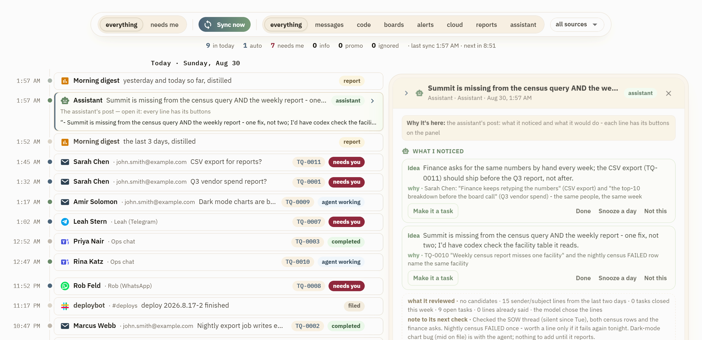
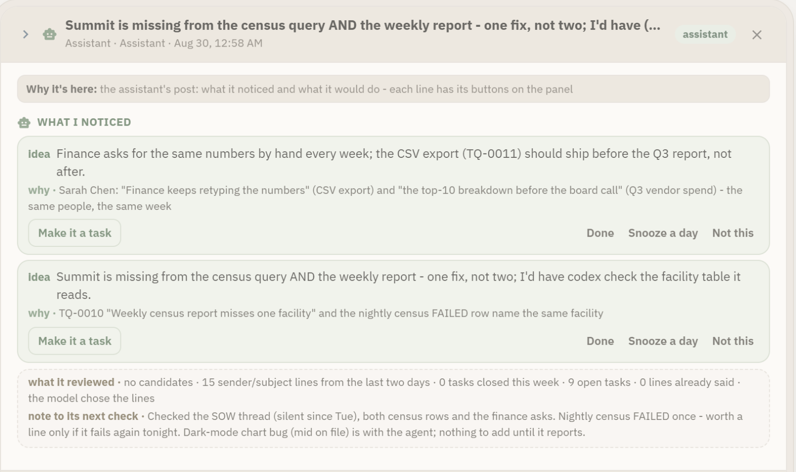
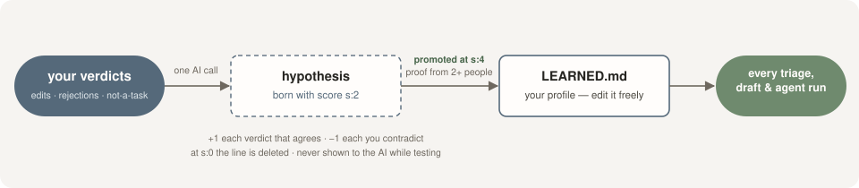
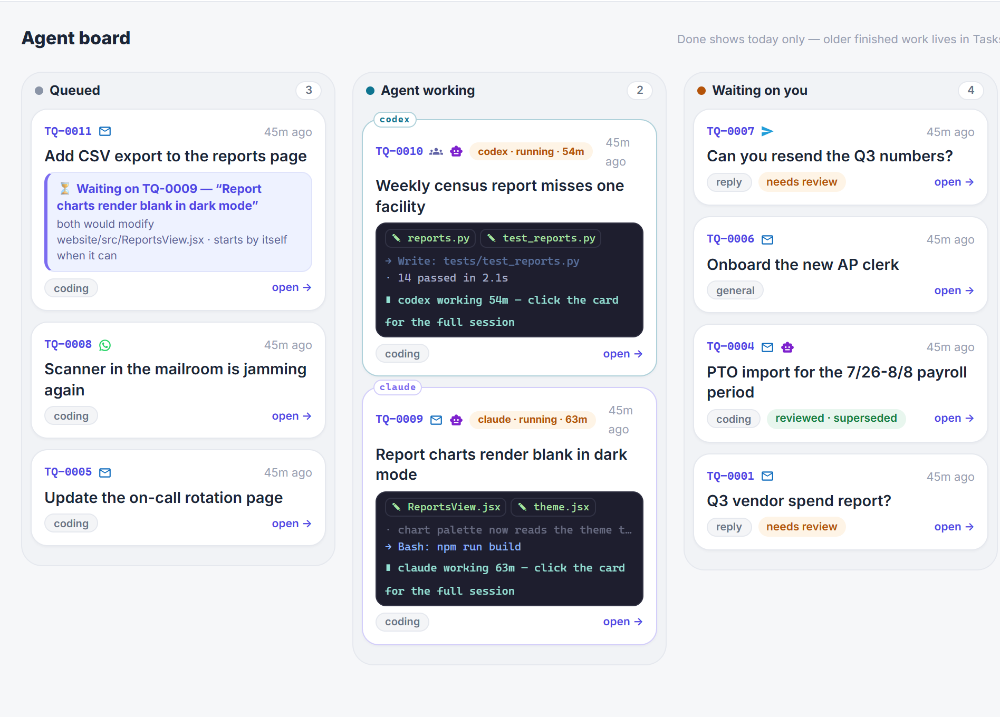
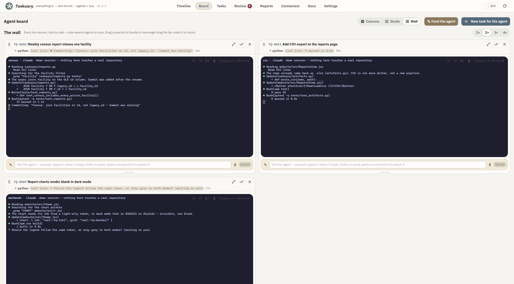
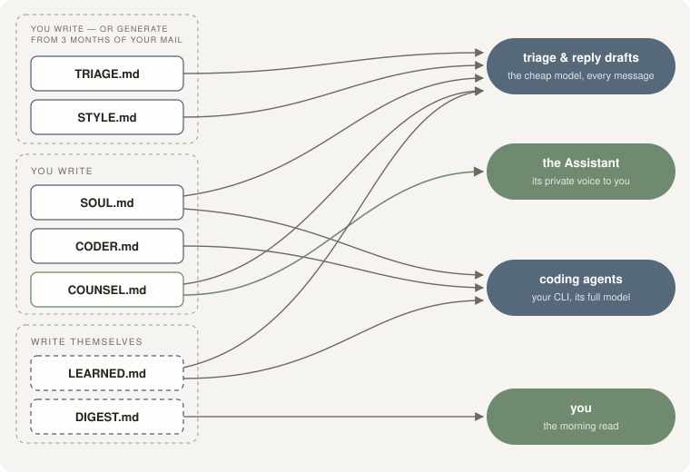

# Product guide

## The workflow

Work arrives as messages, but work is tasks—and people usually become the translation
layer. They read the message, decide what it means, open the ticket, do the work, and write
back.

Taskuary automates the ends and leaves you the middle:

1. Mail, chats, issues, incidents, and reports arrive on one Timeline.
2. AI triage files noise, drafts answers to questions, and turns concrete work into tasks.
3. Coding tasks run in the CLI and repository you configured. General, research, marketing,
   and triage tasks run in a conversational workspace; its assistant and terminal views share
   one session, and both can sit beside the session browser. Plain tasks wait on your list.
   See [The five roads](#the-five-roads) for what each verdict means.
4. Results and replies return for review. Nothing sends or ships without approval. A triaged
   coding task may close itself when its agent finishes; owner-controlled tasks never do.

Nothing leaves the machine except calls to services you explicitly configure.

## The five roads

Every message that arrives gets one verdict, and there are only five places it can go. Triage
writes the verdict; the Timeline shows which road was taken and lets you argue with it.

| Road | What it means | What happens |
|---|---|---|
| **fyi** | nothing to do | filed; it stays readable, nothing is created |
| **reply** | a sentence settles it | a draft goes to Review for you to approve |
| **coding** | an agent on a keyboard | a CLI session starts in the checkout it picks |
| **general** | talk it through with the assistant | a conversation opens on the task; no system is touched |
| **task** | yours to do | it lands on your list and nothing works it |

Three of those are task *kinds* stored on the task itself (`coding`, `general`, `task`), and they
are what routes the work. `reply` is a kind too; `fyi` creates nothing.

### The order it is decided in—and which steps are gates

The verdict is the *last* thing that happens, not the first. Eleven checks run in a fixed order
(`ingest_message` in `taskuary/ingest.py`), and only two of them ask a model anything. A **gate**
is deterministic—same input, same answer, no AI call, no cost. Knowing which is which is how you
tell "triage got this wrong" from "a rule caught it before triage ever saw it".

| # | Step | Gate or AI | What it does |
|---|---|---|---|
| 1 | Dedupe | gate | A message whose `external_id` is already stored is dropped as `duplicate`. Nothing below runs. |
| 2 | Feed connections | gate | A connection marked a *feed* lands on the Timeline as `feed` and stops. No verdict, no AI call, no task—cheaper and quieter than `ignore`, which is a judgement *about* the message. |
| 3 | Policy rules | gate | Your rules, plus whether the sender is known. `skip` and `ignore` end it here; `escalate` only marks the task urgent further down. |
| 4 | Deferral | gate | When triage is deferred the message lands as `triaging` so the Timeline shows it at once; everything below runs later, in `drain()`. Decides nothing itself. |
| 5 | Chat opener | gate | "hi", "you there?"—filed to wait for the ask it opens, so a greeting never becomes a task. |
| 6 | Threading | gate (scored) | Similarity against open tasks picks *attach* or *create* (`attach_threshold`, 0.42 by default); then `own_thread_only` refuses a thread that is not yours. |
| 7 | Still the same ask? | **AI** | Chats only, and only when step 6 attached: one call asks whether this line continues that task or starts a separate one. |
| 8 | Your standing ruling | gate (memory) | If you already ruled on this conversation it is filed, quoting your own words as the reason. Your rulings outrank the classifier. |
| 9 | An agent is waiting | gate | If a run is live on the attached task, **no verdict is asked for at all**—the message goes to the agent as its answer. |
| 10 | The verdict | gate, then **AI** | `decided_intent` settles tracker items, obvious noise and calendar invites with no call at all. Everything else is one call, reading `TRIAGE.md`, `SOUL.md`, `LEARNED.md` and your past verdicts as evidence. |
| 11 | Acting on it | gate | `fyi` files. `reply_only` files instead of drafting when replies are off for that channel. Anything else becomes a task with its kind. |

Two rules hold wherever the AI is involved: with no AI connector the message is **filed** with
"awaiting AI triage" rather than guessed at, and a call that fails or answers something unreadable
is filed too—never assumed to be work. Triage breaking is quiet and safe, not destructive.

So a message that never reached the classifier was stopped by steps 1–6 or 8–9, and the fix is a
rule, a feed, or a ruling. A message the classifier *did* judge and got wrong is corrected on the
Triage tab, which teaches `TRIAGE.md` (below).

### general means the assistant's chat—everywhere

This word used to mean two different things, which is worth knowing if you are reading older
notes or an unedited `TRIAGE.md`. Triage used `general` for *"no agent can do this, it is yours"*,
while the Board, ＋ New and the task workspace all treated the same value as *"the assistant's
conversation"*. One stored value, two meanings, and the road nobody could act on from the
Timeline.

It now means the conversation, in every surface:

- Triage rules a message `general` when there is nothing to type at a system but thinking,
  reading or research would help—weigh an option, make sense of a thread, work out what to ask.
- **Talk it through** on a Timeline row opens that conversation on the message.
- ＋ New → *Give an agent a job* → **Just talk it through** starts one from nothing.
- *Prepare me for it* on a calendar invite opens one with the invite as context.
- The Board's *General—no repository* and the Tasks tab do what they always did.

Work that a person genuinely has to do in the world—sit a course, sign a form, attend, decide,
make a call—is the `task` road. Nothing is dispatched at it and nothing drafts a reply to it; it
waits on your list. **This one is mine** on a Timeline row creates one directly.

Only `coding` is ever dispatched automatically. A conversation you did not ask for is noise, and
a `task` is yours by definition—so both land on the Board and wait for your click.

### Correcting a verdict teaches it

The roads on the Triage tab are not decoration. Correcting one writes the reason into
`TRIAGE.md`, which is the document the classifier reads on the next message—so the correction
applies to the next message *like* this one, not as a rule about this sender. Your standing
verdicts are read by the assistant's brief as well, so a subject you have ruled out stops coming
back on both surfaces.

## Timeline and workspace



The Timeline is the front door. Its chips distinguish work that needs you from completed,
filed, informational, promotional, and automated items. Open a row to see the complete
message, inline attachments, triage reasoning, a drafted reply, and the available actions.

The rest of the workspace answers a specific question:

- **Board** shows queued, working, waiting, and completed agent tasks. Working cards include
  a live terminal view and the files modified so far.
- **Studio** renders agent capacity as a floor: one desk per slot, an occupied desk for a
  running task, and a raised hand for a session waiting on you.
- **Wall** puts every live terminal side by side, with a prompt box under each session.
- **Tasks** separates the durable task, one agent session, and communication with the sender.
  You can stop or finish an agent run without completing the task, restart with a different
  coding harness and a new prompt, reply without closing owner-controlled work, and explicitly
  reopen or mark the task done. See [Tasks, agent sessions, and replies](task-lifecycle.md).
  When the agent opens a web
  page (through the optional `agent-browser` tool), the page appears live beside the terminal:
  the browser takes the larger share, a handle between the two resizes it, and it folds away
  when the browser closes. **Take over** gives you the mouse and keyboard for a password or a
  2FA code the agent must never type; **Snapshot** keeps the frame on the task as an
  attachment. On the Wall, a narrow tile shows a "browser" chip that opens the page over the
  session.
- **Review** is the outbound decision queue. Approved replies go back through the channel
  where the conversation started.
- **Reports** turns connected data into scheduled Timeline items, spreadsheets, charts, and
  summaries. Every report can be previewed before it is scheduled.
- **Connections** controls sources and their roles: trigger, feed, report, tool, and notify.
  The **Knowledge base** card there indexes the documents you already keep — SharePoint
  library folders and folders on this machine — into Taskuary's own database, on this
  machine. Once anything is indexed, a `kb_search` report answers questions from it on a
  schedule, agents call the same search as a tool, and the reply drafter, the Assistant and
  coding sessions receive the passages that bear on a thread; a nightly `kb_reindex` report
  keeps it fresh. Passages are treated as facts to cite, never as instructions.
- **Docs** contains the Markdown documents that govern Taskuary's behavior.
- **Settings** contains routing policies, assistant thresholds, notification preferences,
  agent capacity, learned memory, and audit verification.

Calendar-aware drafts use connected Outlook or Google calendars. They avoid offering busy
times and say when a calendar cannot be read instead of inventing availability.

## The Assistant



The Assistant runs on its own schedule and when the app opens. It posts only when it finds
something useful: an unanswered reply, context for an upcoming meeting, a quiet task, or a
pattern across incoming work. Each suggestion names its evidence and offers **Make it a
task**, **Done**, **Snooze a day**, and **Not this**.

Every post also records what it reviewed and leaves a note for the next check. That keeps it
from researching the same silence or repeating the same suggestion. **Not this** teaches it
which kinds of nudges you do not want.

Three controls shape it:

- `COUNSEL.md` on the Docs tab controls how it speaks and how readily it takes a position.
- The **Assistant** report controls what it watches for, its schedule, and the model it uses.
- **Settings → Assistant** controls thresholds such as how long a reply or task must be quiet.

Delete the Assistant report to turn it off.

It also watches the systems you point it at. Its Pipeline step takes source cards of its own—an
Intacct query, a database, a REST or MCP tool, a file, an agent skill—and no saved report needs
to stand behind them. Because that step asks you to know an object name and a list of field ids,
you can describe what it should keep an eye on instead and the AI writes the cards: it may only
choose connections that exist, it reads the real schema before writing a query, and it asks
rather than guessing. The same help sits on every individual source card, in the report builder
and here. [Reports and the Assistant](reports-and-assistant.md) covers the whole builder.

## Learning from your decisions

Every verdict is evidence. Editing a draft teaches voice; rejecting one teaches what should
not be drafted; choosing **Not our task** teaches where your responsibility ends. The exact
decision is kept with its date, sender, and subject so future triage can judge whether a new
message is genuinely similar.



General lessons take a stricter path so one unusual decision does not become a permanent
rule. Each machine-written line in `LEARNED.md` has a score and receipts:

```text
- John drops greetings and signs off in one word. [s:4 | ev: rv12,rv15,rv31 | seen: 2026-08-19]
```

- `s` is the strength. A hypothesis starts at 2, gains a point when evidence agrees, loses
  one when evidence contradicts it, becomes active at 4, and is removed at 0.
- `ev` identifies the verdicts that taught the lesson.
- `seen` is the last date on which it held.

Delete a learned line and it is gone. Lines you write yourself have no machine tag and are
never changed. A learned rule that would hide mail waits for explicit approval, and
`SOUL.md` always outranks `LEARNED.md`. One Settings switch disables the learning loop.

**Generate from history** on `TRIAGE.md` and `STYLE.md` can bootstrap this process from the
last three months of mail. It compares inbound threads with what you actually answered and
distills the result into a marked block, preserving anything you wrote outside that block.

## Processing modes

Each inbound connector chooses how tasks it creates reach agents:

- **One by one** dispatches in arrival order. When all agent slots are occupied, tasks wait
  first in, first out.
- **Ranked together** orders a shared queue by value and runs only the top tasks. New work
  reranks the queue rather than automatically joining the end.

Ranked value begins with deterministic evidence such as whether you were directly addressed,
how many people received the message, whether somebody already answered, urgency, and the
author. When multiple tasks wait, the triage brain adds a short comparative reason. Waiting
tasks gain value over time so the bottom cannot starve.

The Timeline and Board expose the same order. **Start now** pins a task to the top; **Later**
moves it down without deleting it.

## Multiple agents in one repository



Taskuary can auto-dispatch several coding sessions while reducing collisions in a shared
checkout:

- **Affinity routing** asks whether a queued task is likely to modify the same files as a
  running task. Likely overlap waits and starts automatically when the first session ends.
- **Tell the agent** queues new prompts until the CLI returns to its prompt. Notes never land
  in the middle of a turn or on top of a question waiting for you. Lists drip in one item per
  stop; pasted screenshots are saved locally and named in the note.
- **The blackboard** shows files each session has actually modified, calculated from Git and
  the run trace rather than from its plan. A new agent in the same checkout receives that
  picture at startup.
- **First in has control.** The newcomer is told which files belong to another session and
  must not edit, revert, stash, or commit them.



The Wall supports the same sessions side by side. Panes can be rearranged and resized, and
each has its own queued-prompt box and waiting indicator.

## The operator documents

Taskuary's behavior is governed by plain Markdown on the Docs tab:

| Document | Purpose | Read by |
|---|---|---|
| `TRIAGE.md` | What makes an item a task, reply, or FYI; can generate a history block from answered and ignored mail | Triage |
| `STYLE.md` | Greeting, tone, length, and phrasing; can generate a history block from sent mail | Reply drafts |
| `COUNSEL.md` | How the Assistant speaks to you and how strongly it takes a position | Assistant, the morning brief and reply drafts |
| `SOUL.md` | The constitution: rules, voice, escalation lines, and repository map | Triage, replies, coding agents |
| `CODER.md` | How coding agents work and close out | Coding agents |
| `LEARNED.md` | The profile learned from verdicts; always subordinate to `SOUL.md` | Triage, replies, coding agents |
| `DIGEST.md` | The current morning brief — what slipped, today, what happened — written by the Morning digest report | You |
| Playbooks (`~/.taskuary/playbooks/*.md`) | One per kind of job — when it starts, which connections it uses, the steps, what an agent may do alone, what to ask first, what counts as done | Triage (the `when` line), the agent working it |



Playbooks are the document that grows: `CODER.md` is the playbook for code, and every other kind
of job — a card charge to post as a bill, a new hire to set up — gets its own page the first time
an agent does it. On close Taskuary asks whether the session did a kind of job that will recur and,
if so, drafts the playbook into Review; approve it (edit it first if you like) and the next such
message is matched to it by triage and the agent is seeded from it instead of `CODER.md`'s
repository rules. Each connector card lists the playbooks that name it, and the Docs tab is where
the words are edited. See [Beyond code](beyond-code.md).

Each coding session also receives a context file under `~/.taskuary/context/`. It contains
the task thread, relevant sender and topic history, the learned profile, and reports from
related closed tasks so the agent starts with what Taskuary already knows.

## Bring your own coding agent

Every run can choose a configured CLI and, when supported, a model. Built-in presets cover
Claude Code, Codex, Gemini, Cursor, and Copilot. Any CLI that accepts a prompt on stdin can
work; the connector lets you define its command, arguments, model argument, and working
directory behavior.

Headless agents need their noninteractive or auto-approval flag so they do not hang waiting
for a click that cannot occur. The connector's **Test** action runs a small prompt through the
CLI before it receives real work. Claude Code JSON output is parsed for resumable sessions;
plain-text CLIs work as well.

## Related documentation

- [Getting started](getting-started.md)
- [Reports and the Assistant](reports-and-assistant.md)
- [Integrations](integrations.md)
- [Status and roadmap](roadmap.md)
- [Contributing](../CONTRIBUTING.md)
