A task in Taskuary is three records, not one: the durable job, the agent work done on it, and the
reply to whoever asked. They start and finish independently, and keeping them apart is what stops
the word "done" meaning three different things.

## A task's three lives

The task page shows them as one numbered workflow — **1 Task → 2 Agent work → 3 Reply** — and
each stage owns exactly one state badge.

| Part | What it records | Main controls | What it never does by itself |
|---|---|---|---|
| **Task** | The durable job and who owns it | owner, kind, priority, Reopen, Mark done | Starting or ending an agent session does not complete it |
| **Agent work** | One or more attempts by a coding or non-coding agent, plus the saved result | harness, model, new prompt, start, prompt, pause, finish, stop | Stopping does not mark the task done or send a reply |
| **Reply** | Communication with the person who asked | write, generate, edit, approve and send | Sending it marks the task done — unless an agent is still working or a new message came in |

While a terminal or an assistant chat is live, the task collapses to a one-line context strip and
the workspace takes most of the page. Full controls, saved results and restart choices come back
when the agent stops.

### Who is allowed to close it

There is one close, **Mark done**, and every road below leads to it. Mark done always does the
same five things: the task is done, any unsent draft is kept but retired, a live agent is stopped,
it leaves your work rail, and the "yours to end" mark comes off.

| You or an agent does | What happens | Stays open when |
|---|---|---|
| **Mark done** — the task page, the Assistant's button or card, "done" or "close" in the chat, the phone | Mark done | never |
| **Send the reply** | Sends it, then Mark done | an agent is still working on it, or a new message came in while you were answering — it says why |
| **Tick the last checklist box** | Mark done | an agent is still working on it |
| **Hand it to a person** | Forwards it, then Mark done | never |
| **Not ours** / **Not a task** | Deleted if nothing was done on it, otherwise Mark done | never |
| **Mark done** on a channel that cannot send (the draft stays unsent) | Mark done | never |
| **An agent says it is finished** (`taskuary --done`) | The session is written up; the task waits for you with the draft if a reply is owed, otherwise it is done | a reply is owed, or you opened the session yourself |
| **Its pull request is merged or closed** | Same as an agent saying it is finished | a reply is owed |

A task an agent or a merged pull request closed stays on your work rail until you have read it.
A session you started yourself is yours to complete: the agent is told so, and if it says it is
finished anyway its sentence is filed on the task and the task stays open until you mark it done.

These never end a task:

| You do | What happens instead |
|---|---|
| **Save and end session** | The agent stops and its report is written; the task stays open |
| **Reject** a draft | The draft is rejected; the task is untouched |
| **Next** | Read and moved on; open work comes back after a few hours |
| **Remind me** | Put away until the day you pick, then back on your rail that morning |
| A stopped or quiet session | Nothing — only you, or the agent saying so, ends a task |

Reopening a completed task starts a fresh task lifecycle rather than pretending an old terminal
is still alive.

## Sending work to a coding agent

Open **Agent work**, choose the CLI and model, and start. The session is handed the task summary,
the incoming messages, the attachments, any saved result from an earlier run and your optional
new prompt — plus a context file under `~/.taskuary/context/` holding the thread, relevant sender
and topic history, the learned profile, and reports from related closed tasks.

| Control | What it does |
|---|---|
| **Start coding session** | Starts the selected harness and model |
| **Start new coding session** | Picks a different harness after an earlier run stopped or hit a limit; the checkout and history are kept |
| **Give new prompt** | Queues another instruction for the live session |
| **Pause & save** | Ends the session after writing a handoff note for the next one |
| **Save and end session** | Ends the session and writes its result; the task stays open until you mark it done |
| **Stop session** | Ends only the process. Deliberately changes neither task nor reply state |

**Mark done** is stronger than all of them: it closes the task *and* ends any live session,
because a finished task should not leave an orphan process running.

### What an agent is doing

An agent is always in one of six states. Each has one word and one mark, and the work rail, the
Timeline, the task page, the Board, the assistant's cards and the phone all use the same ones.

| Mark | State | What it means | Your move |
|---|---|---|---|
| ⏳ | **waiting to start** | Handed to an agent, not running yet | **Start now** |
| ⚙️ | **agent working** | Running, and needs nothing from you | **Leave a note** for when it stops |
| 👋 | **agent waiting on you** | Running, and it asked you something, needs your approval, or is stuck | Answer it |
| 💾 | **session saved** | You ended it with **Save and end session**; its report is written | **Continue session**, or **Mark done** |
| ⏹ | **agent stopped** | It ended without finishing: a crash, a closed pane, Taskuary closing | **Continue session**, or hand it on |
| ✅ | **agent finished** | The agent, or its merged pull request, closed the task | Read the result |

| It ended because | What you see | What brings it back |
|---|---|---|
| The agent said it was done, or its pull request merged | ✅ **agent finished** - its reply ready for your yes if one is owed | a new message on it |
| You pressed **Save and end session** | 💾 **session saved** - the report is written, the task stays open | **Continue session** |
| You pressed **Mark done** | the task is closed and the agent stopped | they write again |
| The session crashed or was closed, or Taskuary closed | ⏹ **agent stopped** - a reply it had held is back for your yes | **Continue session**, or **Run another agent** |

**Continue session** works for a coding agent (it reopens its own CLI session, or a fresh one seeded with the
handover) and a regular agent (its saved conversation). It asks what to tell it as it picks up - optional; on the
phone the next thing you type is the note, or tap **Continue as is**.

The saved result is deliberately short. Every finished coding session also writes a full Markdown
artifact with that result and the complete transcript — **Work details → Full artifact** on the
task page.

### When the agent opens a browser

With the optional `agent-browser` tool installed, the page the agent is on appears live beside
the terminal. **Take over** hands you the mouse and keyboard for a password or a 2FA code the
agent must never type; **Snapshot** keeps the frame on the task as an attachment. On the Wall, a
narrow tile shows a "browser" chip that opens the page over the session.

## The general agent

Not every job is code. A `general` task opens a conversation instead of a terminal: research,
planning, writing, weighing an option, working out what to ask. No system is touched.

You reach it from **Talk it through** on a Timeline row, from ＋ New → *Give an agent a job* →
**Just talk it through**, or from *Prepare me for it* on a calendar invite.

General chats save their provider, model and native conversation id across restarts. Claude and
Codex resume that exact conversation when it still exists and the provider configuration matches;
otherwise the assistant continues from Taskuary's own saved history and says so.

## Sessions and transcripts

**Continue previous work** on the Assistant page lists unfinished tasks that have saved agent
work, each with an excerpt of the latest reply or handover. **Resume** opens the task and carries
on; **Review draft** opens a pending result. Loading the page starts nothing, and a session
already running is opened rather than duplicated.

Reopening a pane seeds it from a render of the session, not from raw bytes, so a pane you come
back to shows what the screen actually looked like.

## Several agents in one repository

Taskuary can run more than one coding session against a shared checkout, and spends real effort
on not letting them collide:

- **Affinity routing** asks whether a queued task is likely to touch the same files as a running
  one. Likely overlap waits, and starts by itself when the first session ends.
- **Tell the agent** queues your notes until the CLI is back at its prompt, so a note never lands
  mid-turn or on top of a question waiting for you. Lists drip in one item per stop; pasted
  screenshots are saved locally and named in the note.
- **The blackboard** shows what each session has actually modified, computed from Git and the run
  trace rather than from what the agent said it would do. A new agent is handed that picture at
  startup.
- **First in has control.** The newcomer is told which files belong to another session and must
  not edit, revert, stash or commit them.

**Live handoffs** on the Board shows what each agent is working on, what is blocked and what is
ready for someone else, with read markers for which agents have seen each note. The **Hub** is
the longer-lived version of the same idea: discoveries and decisions by topic, so knowledge
outlives the job that produced it.

## Checklists and closing

A task can carry a checklist. Tick the boxes as you go, then press **Mark done** — ticking the last box does not close
the task on its own. Closing a task ticks every remaining box: a closed task with open items is a lie about its own
state.

## Replies

The Reply section exists whenever the task has an incoming sender. It shows one of three things:
no draft yet, a draft ready, or a reply sent. **Open on the task** is the only road out — type your
own or generate one, edit it, approve it.

One reply is special. A **clarification** stops the active agent when it is sent and moves the
task to waiting, because an external answer is now required. An ordinary reply from an
owner-controlled task is just an update: it leaves both the task status and any useful session
alone.

## Profiles and playbooks

Two levels, and the difference is worth holding onto:

- A **profile** is a worker — which CLI, which model, which flags. Install one from a skill or
  configure it on the connector card.
- A **playbook** is a job — when it starts, which connections it uses, the steps, what an agent
  may do alone, what to ask first, and what counts as done.

`CODER.md` is the playbook for code. Every other kind of recurring job gets its own page the
first time an agent does it: on close, Taskuary asks whether that will recur and drafts the
playbook onto the task. Approve it, and the next message like it is matched to that playbook by
triage, and the agent is seeded from it instead of from `CODER.md`'s repository rules.

Each connector card lists the playbooks that name it, and the words themselves are edited on the
**Docs** tab.

## The Tasks list and the Board

Both pages show the same state for a task, in the work rail's words — the server decides it once and both draw it.

| The task | Tasks list | Board column |
|---|---|---|
| handed to an agent, nothing started | ⏳ waiting to start | waiting to start — with what it waits for, or why it could not start, and **Start now** / **Cancel** |
| its agent is running | ⚙️ agent working | agent working |
| its agent asked, needs approval, or is stuck | 👋 agent waiting on you | agent waiting on you |
| you ended its session / it ended by itself | 💾 session saved / ⏹ agent stopped | saved or stopped — with **Continue session** |
| a reply is drafted for your yes | ✉️ reply ready | agent finished, when an agent drafted it |
| its agent closed it | ✅ agent finished | agent finished (today) |
| you closed it | ✅ done | — |
| waiting on somebody else | 📤 waiting on them | — |
| nobody was handed it | 📋 on you | — |

A task put away with **Remind me** is under **upcoming** and off the Board until its day — unless its agent asks you
something. Status has no box of its own: **Start**, **Mark done**, **Remind me** and **Reopen** set it, and Reopen clears
an old reminder. **Mark done** keeps a draft that was waiting; **Bring it back to send** sends it after all. Done is
listed by task number, highest first.

## The work rail

The rail beside the Assistant holds what still wants something from you - nothing finished, and never a history.

| Heading | What lands there | Comes back to it |
|---|---|---|
| **Urgent** | A meeting starting within 15 minutes; an ask triage called urgent (a deadline today or tomorrow, someone blocked now); a sender on your escalate list | - |
| **Your task** | A person's ask, a reply ready for your yes, an agent waiting on you, an agent waiting to start, an agent stopped or a session saved, a check that failed, a task an agent finished | Passed work after 3 hours |
| **Passed** | Your work you pressed **Next** on - still yours, not offered again by the walk | - |
| **Reports** | A report run that landed | - |
| **FYI** | People told you things; rows whose triage failed | - |
| **Agents working** | An agent busy on a task - nothing for you until it stops or asks | - |

| You or it does | It goes | Back when |
|---|---|---|
| **Next** on your open work | Passed | after 3 hours (Settings → Passed work comes back after), or a new message |
| **Next** on anything else | off | a new message, note or edit on it |
| **Mark done** | off | THEY write after the close - your own reply does not count |
| **Remind me** | Upcoming in Tasks | 07:00 on that day, saying "you asked to be reminded about this today" |
| Its agent closes the task | "Agent finished" until you read it | a new message on it |
| A draft decided anywhere, an idea dismissed | off | they write again |
| An auto-reply, a withdrawn message, a thread where yours is the last word | never shown (Settings → Hide auto-replies and answered threads) | - |
| A meeting starts | off 5 minutes in (Settings) | - |
| **Next** on a failed connection | off | a different error |
| Older than 14 days | off - search Tasks for it | a new message; a Remind me date |

## How work is ordered

Each inbound connector chooses how the tasks it creates reach agents:

- **One by one** dispatches in arrival order; when every slot is busy, tasks wait first in, first
  out.
- **Ranked together** orders a shared queue by value and runs only the top tasks. New work
  reranks the queue rather than joining the end of it.

Ranked value starts from deterministic evidence — were you addressed directly, how many people
were on it, has someone already answered, urgency, who wrote it — and the triage brain adds a
short comparative reason when several tasks are waiting. Waiting tasks gain value over time, so
the bottom of the queue cannot starve.

The Timeline and the Board show the same order. **Start now** pins a task to the top; **Later**
moves it down without deleting it.
