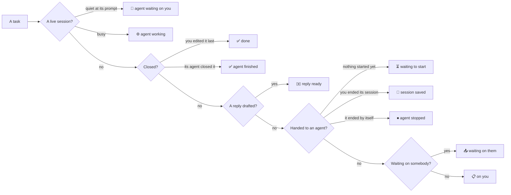

# The Tasks list and the Board

One state per task, decided on the server (`taskuary/taskstate.py`) with the work rail's own rules and words
(`taskuary/lanes.json`). The Tasks list's chip and the Board's column both draw it, so the two pages cannot disagree -
decided with the owner on 2026-09-25 (T1-T19): "everything should be the task list and the board just follows
whatever is going on there".

| # | Decision | Built |
|---|---|---|
| T1 | The list's chip is the rail's word and mark - never "on you" for an agent's task | `taskstate.state` → `stateOf` |
| T2, T3 | Board columns are the agent states: waiting to start · working · waiting on you · saved or stopped · finished today (with its reply ready) | `BoardView` |
| T4 | One word for one thing: "reply ready", "done", the agent's own sentence for what it asks | lanes.json |
| T5 | No agent line on a task nobody handed to an agent | `agentPhase({handed})` |
| T6 | "agent finished" when the agent closed it; the heading says asked, needs approval or stuck | `agentPhase({finished})` |
| T7 | Remind me holds a card off the Board until its day - unless its agent asks you | `BoardView` |
| T8, T9 | A continued task is live on both pages; both reread the same rows, and a session going quiet rereads them | `/api/tasks` `State` |
| T10 | A queued start says what it waits for, or why it could not start, with Start now and Cancel | `QueuedStart.jsx` |
| T11 | Mark done keeps a waiting draft; "Bring it back to send" sends it later | `/api/reviews/{id}/reopen` |
| T12 | No status box - status follows Start, Mark done, Remind me and Reopen | `TasksView` |
| T13 | Reopen clears an old Remind me date | `task.reopen` |
| T14 | Continue session opens the rail's box, with a note for the agent | `ContinueBox.jsx` |
| T15 | "Save result" once the session has ended; "Continue session" on a regular agent's conversation | `TasksView` |
| T16 | Ticking the last box does not close the task - Mark done does | `tick_checklist` |
| T17 | Done is by task number, highest first | `TasksView` |
| T18 | The unreachable "yours, not the agent's" dialog and the Board's drag leftovers are gone | |
| T19 | The diff's Refresh keeps the scope on screen; sending a reply refreshes the list | `TasksView` |
