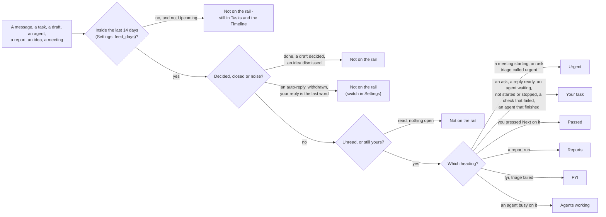
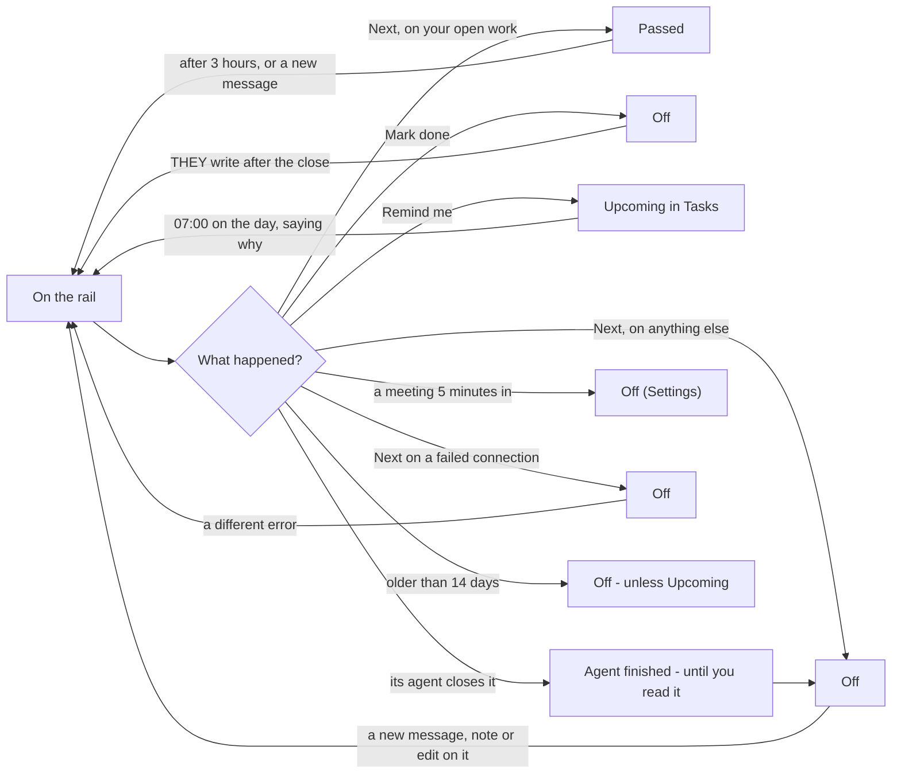

# The work rail

What puts something on the rail beside the Assistant, which heading it sits under, what takes it off and what brings
it back - as decided with the owner on 2026-09-25 (R1-R15) and built the same day. The code is
`taskuary/processing_unread.py` (what is on the rail and under which heading), `funnel.py` (meetings, broken
connections, the walk's marks) and `remind.py` (Remind me).

## On the rail, and under which heading

## What takes it off, and what brings it back

## The rules

| # | Rule | Decided |
|---|---|---|
| R1 | Older than 14 days falls off, whatever it is - search Tasks for it. A task you put away with Remind me comes back on its day however old it is (the morning note is new activity). The 14 days is display only; nothing is deleted | keep |
| R2 | An urgent item with no task behind it leaves on Next. A draft with no task is rare (a setting change waiting for a yes, a report's outgoing message) | keep |
| R3 | Urgent work goes to Passed on Next and back after 3 hours, like the rest | keep |
| R4 | A draft decided anywhere (sent, rejected, no reply) and an idea you dismissed leave the rail, until they write again | built |
| R5 | Withdrawn messages, auto-replies and threads where yours is the last word are hidden - Settings, "Hide auto-replies and answered threads", on by default. A message a rule ignored still shows | built |
| R6 | A stopped agent goes to Passed on Next and comes back after 3 hours; Mark done closes it | built |
| R7 | Remind me puts away a live agent or a paused conversation too, until its day | built |
| R8 | "Stop showing me these" is the Assistant's tools (Not ours from now on, a rule in Settings), never a phrase list | built |
| R9 | Silencing a sender for good is Not ours → from now on | as it is |
| R10 | Next on a failed connection dismisses it; a different error comes back | built |
| R11 | A new walk raises an agent waiting on you again | built |
| R12 | No mail-only walk - the Assistant picks a set when asked | removed |
| R13 | A reminded task says "you asked to be reminded about this today" on its day | built |
| R14 | A task with no message is Your task, like one with mail | built |
| R15 | Stale comments and the page's fallback table (a finished agent's task is Your task, not Reports) | cleaned |
